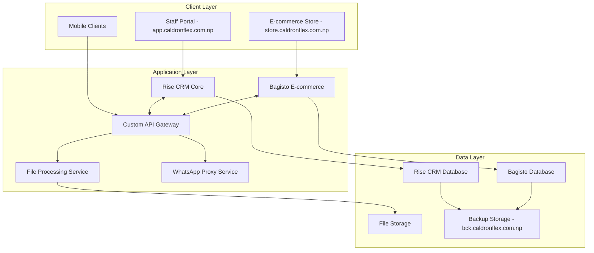

# Design Document

## Overview

The Caldron Flex All-in-One Printing Business Management System is designed as a comprehensive solution that leverages existing open-source platforms while adding printing-specific functionality. The system uses Rise CRM as the primary platform ("the brain") with Bagisto integration for e-commerce, creating a unified ecosystem that manages the complete printing business workflow from order submission to completion.

The architecture follows a "core and satellite" approach where Rise CRM handles the core business logic, user management, and printing workflows, while Bagisto provides the public-facing e-commerce storefront. Real-time API synchronization ensures data consistency across both platforms.

## Architecture

### High-Level Architecture



### Platform Integration Strategy

**Rise CRM Extensions:**
- Custom printing workflow modules
- Enhanced task management with queue-based assignment
- Design file management and annotation system
- Credit management for organizations
- WhatsApp integration service
- Printing-specific reporting modules

**Bagisto Customizations:**
- Printing product catalog with dynamic pricing
- AR/VR integration for product preview
- Custom product configurators
- Integration APIs for Rise CRM synchronization

**API Synchronization Layer:**
- Real-time data sync between platforms
- Customer data unification
- Inventory synchronization
- Order processing coordination
###
 Deployment Architecture

**cPanel Hosting Constraints:**
- Single server deployment without Docker
- PHP-based applications only
- Limited to 3GB RAM, 1.5TB storage
- File storage optimization required

**Subdomain Strategy:**
- `app.caldronflex.com.np`: Rise CRM main application
- `store.caldronflex.com.np`: Bagisto e-commerce store
- `api.caldronflex.com.np`: API gateway and services
- `files.caldronflex.com.np`: File storage and processing
- `bck.caldronflex.com.np`: Backup storage

## Components and Interfaces

### Core Components

#### 1. User Management System
**Based on Rise CRM Users_model with extensions:**

```php
// Extended user roles for printing business
class PrintingUsers_model extends Users_model {
    // Additional fields for printing-specific roles
    protected $printing_roles = [
        'system_admin' => 'full_access',
        'staff_admin' => 'operational_access',
        'staff_helper' => 'limited_access_no_purchase_price',
        'org_admin' => 'organization_management',
        'org_member' => 'configurable_permissions',
        'individual_customer' => 'personal_account',
        'guest_user' => 'minimal_registration'
    ];
}
```

**Key Features:**
- Role-based permission system
- Organization hierarchy management
- Guest user minimal registration
- Staff permission configuration

#### 2. Order Management System
**Extended from Rise CRM Orders_model:**

```php
class PrintingOrders_model extends Orders_model {
    // Additional fields for printing workflow
    protected $printing_fields = [
        'design_files' => 'json',
        'annotation_data' => 'json',
        'revision_count' => 'integer',
        'urgent_flag' => 'boolean',
        'queue_status' => 'enum',
        'assigned_staff' => 'integer',
        'design_approval_status' => 'enum'
    ];
}
```

**Workflow States:**
- New → Queue → Claimed → Design → Client Review → Revision → Approval → Production → Complete

#### 3. Design File Management System
**Custom component for printing-specific file handling:**

```php
class DesignFileManager {
    public function uploadFile($file, $order_id);
    public function convertTiffToJpg($file_path);
    public function addWatermark($image_path);
    public function generatePreview($file_path);
    public function storeAnnotations($order_id, $annotations);
    public function getFileVersions($order_id);
}
```

**Features:**
- Multi-format file support (JPEG, PDF, SVG, PSD, PNG, TIFF)
- Automatic TIFF to JPG conversion
- Watermark application
- Progressive upload for large files (up to 500MB)
- Secure file access controls#### 4. P
roduct Catalog System
**Integration between Rise CRM Items_model and Bagisto Product model:**

```php
class PrintingProducts_model extends Items_model {
    protected $printing_categories = [
        'flex_banner' => ['pricing_type' => 'per_sqft', 'range' => '40-150'],
        'certificate' => ['pricing_type' => 'per_piece', 'range' => '99-299'],
        'token_of_love' => ['pricing_type' => 'per_piece', 'range' => '250-4000'],
        'photo_frame' => ['pricing_type' => 'per_piece', 'range' => '349-3000'],
        'stamps' => ['pricing_type' => 'per_piece', 'range' => '300-500'],
        'metal_medals' => ['pricing_type' => 'configurable', 'bundle_option' => true]
    ];
}
```

#### 5. Task Queue Management System
**Custom queue system built on Rise CRM Tasks_model:**

```php
class PrintingTaskQueue {
    public function addToQueue($order_id, $priority = 'normal');
    public function claimTask($task_id, $staff_id);
    public function updateTaskStatus($task_id, $status);
    public function getAvailableTasks($staff_id);
    public function setPriority($task_id, $priority);
}
```

#### 6. Communication System
**WhatsApp and Email integration:**

```php
class CommunicationService {
    public function sendWhatsAppMessage($phone, $message, $template_id);
    public function sendEmailNotification($email, $subject, $body, $template);
    public function sendStatusUpdate($order_id, $status);
    public function sendInvoice($order_id, $client_id);
}
```

### Interface Specifications

#### 1. Staff Portal Interface
**Built on Rise CRM framework with custom modules:**

- **Dashboard**: Order overview, task queue, performance metrics
- **Task Management**: Queue view, task claiming, status updates
- **Order Processing**: Order details, file management, client communication
- **Design Tools**: File upload, annotation viewer, approval workflow
- **Client Management**: Customer database, credit management, communication history
- **Inventory Management**: Stock levels, alerts, purchase tracking
- **Reporting**: Daily, weekly, monthly reports with custom filters

#### 2. Client Portal Interface
**Extended Rise CRM client portal:**

- **Order Submission**: Product selection, file upload, specifications
- **Order Tracking**: Status updates, timeline view, communication history
- **Design Review**: Annotation tool, feedback submission, approval process
- **Account Management**: Profile, organization members, credit status
- **Order History**: Past orders, reorder functionality, invoice access

#### 3. E-commerce Storefront
**Bagisto-powered with printing customizations:**

- **Product Catalog**: Printing products with dynamic pricing
- **Product Configurator**: Size, material, quantity selection
- **AR/VR Preview**: 3D product visualization
- **Shopping Cart**: Integration with main order system
- **Customer Account**: Synchronized with Rise CRM customer data#
### 4. Product Catalog System
**Integration between Rise CRM Items_model and Bagisto Product model:**

```php
class PrintingProducts_model extends Items_model {
    protected $printing_categories = [
        'flex_banner' => ['pricing_type' => 'per_sqft', 'range' => '40-150'],
        'certificate' => ['pricing_type' => 'per_piece', 'range' => '99-299'],
        'token_of_love' => ['pricing_type' => 'per_piece', 'range' => '250-4000'],
        'photo_frame' => ['pricing_type' => 'per_piece', 'range' => '349-3000'],
        'stamps' => ['pricing_type' => 'per_piece', 'range' => '300-500'],
        'metal_medals' => ['pricing_type' => 'configurable', 'bundle_option' => true]
    ];
}
```

#### 5. Task Queue Management System
**Custom queue system built on Rise CRM Tasks_model:**

```php
class PrintingTaskQueue {
    public function addToQueue($order_id, $priority = 'normal');
    public function claimTask($task_id, $staff_id);
    public function updateTaskStatus($task_id, $status);
    public function getAvailableTasks($staff_id);
    public function setPriority($task_id, $priority);
}
```

#### 6. Communication System
**WhatsApp and Email integration:**

```php
class CommunicationService {
    public function sendWhatsAppMessage($phone, $message, $template_id);
    public function sendEmailNotification($email, $subject, $body, $template);
    public function sendStatusUpdate($order_id, $status);
    public function sendInvoice($order_id, $client_id);
}
```

### Interface Specifications

#### 1. Staff Portal Interface
**Built on Rise CRM framework with custom modules:**

- **Dashboard**: Order overview, task queue, performance metrics
- **Task Management**: Queue view, task claiming, status updates
- **Order Processing**: Order details, file management, client communication
- **Design Tools**: File upload, annotation viewer, approval workflow
- **Client Management**: Customer database, credit management, communication history
- **Inventory Management**: Stock levels, alerts, purchase tracking
- **Reporting**: Daily, weekly, monthly reports with custom filters

#### 2. Client Portal Interface
**Extended Rise CRM client portal:**

- **Order Submission**: Product selection, file upload, specifications
- **Order Tracking**: Status updates, timeline view, communication history
- **Design Review**: Annotation tool, feedback submission, approval process
- **Account Management**: Profile, organization members, credit status
- **Order History**: Past orders, reorder functionality, invoice access

#### 3. E-commerce Storefront
**Bagisto-powered with printing customizations:**

- **Product Catalog**: Printing products with dynamic pricing
- **Product Configurator**: Size, material, quantity selection
- **AR/VR Preview**: 3D product visualization
- **Shopping Cart**: Integration with main order system
- **Customer Account**: Synchronized with Rise CRM customer data#### 4.
 API Interfaces
**RESTful APIs for system integration:**

```php
// Customer synchronization API
POST /api/customers/sync
GET /api/customers/{id}
PUT /api/customers/{id}

// Order synchronization API
POST /api/orders/sync
GET /api/orders/{id}
PUT /api/orders/{id}/status

// Product synchronization API
POST /api/products/sync
GET /api/products
PUT /api/products/{id}

// File management API
POST /api/files/upload
GET /api/files/{id}
POST /api/files/{id}/annotations
```

## Data Models

### Core Data Models

#### 1. Extended User Model
```sql
-- Extension to Rise CRM users table
ALTER TABLE users ADD COLUMN printing_role VARCHAR(50);
ALTER TABLE users ADD COLUMN organization_permissions JSON;
ALTER TABLE users ADD COLUMN can_access_purchase_price BOOLEAN DEFAULT TRUE;
```

#### 2. Printing Orders Model
```sql
-- Extension to Rise CRM orders table
ALTER TABLE orders ADD COLUMN design_files JSON;
ALTER TABLE orders ADD COLUMN annotation_data JSON;
ALTER TABLE orders ADD COLUMN revision_count INT DEFAULT 0;
ALTER TABLE orders ADD COLUMN urgent_flag BOOLEAN DEFAULT FALSE;
ALTER TABLE orders ADD COLUMN queue_status ENUM('new', 'claimed', 'in_progress', 'review', 'approved', 'production', 'complete');
ALTER TABLE orders ADD COLUMN assigned_staff_id INT;
ALTER TABLE orders ADD COLUMN design_approval_timestamp DATETIME;
```

#### 3. Design Files Model
```sql
CREATE TABLE design_files (
    id INT PRIMARY KEY AUTO_INCREMENT,
    order_id INT NOT NULL,
    original_filename VARCHAR(255),
    stored_filename VARCHAR(255),
    file_type VARCHAR(50),
    file_size BIGINT,
    preview_path VARCHAR(255),
    upload_timestamp DATETIME,
    uploaded_by INT,
    FOREIGN KEY (order_id) REFERENCES orders(id),
    FOREIGN KEY (uploaded_by) REFERENCES users(id)
);
```

#### 4. Annotations Model
```sql
CREATE TABLE design_annotations (
    id INT PRIMARY KEY AUTO_INCREMENT,
    order_id INT NOT NULL,
    file_id INT NOT NULL,
    annotation_data JSON,
    created_by INT,
    created_at DATETIME,
    revision_number INT,
    FOREIGN KEY (order_id) REFERENCES orders(id),
    FOREIGN KEY (file_id) REFERENCES design_files(id),
    FOREIGN KEY (created_by) REFERENCES users(id)
);
```

#### 5. Printing Products Model
```sql
-- Extension to Rise CRM items table
ALTER TABLE items ADD COLUMN pricing_type ENUM('per_piece', 'per_sqft', 'configurable', 'custom_quote');
ALTER TABLE items ADD COLUMN price_range_min DECIMAL(10,2);
ALTER TABLE items ADD COLUMN price_range_max DECIMAL(10,2);
ALTER TABLE items ADD COLUMN has_variants BOOLEAN DEFAULT FALSE;
ALTER TABLE items ADD COLUMN variant_config JSON;
```

#### 6. Credit Management Model
```sql
CREATE TABLE client_credit (
    id INT PRIMARY KEY AUTO_INCREMENT,
    client_id INT NOT NULL,
    credit_limit DECIMAL(10,2) DEFAULT NULL,
    current_balance DECIMAL(10,2) DEFAULT 0,
    last_updated DATETIME,
    FOREIGN KEY (client_id) REFERENCES clients(id)
);
```##
# Data Synchronization Models

#### 1. Sync Status Tracking
```sql
CREATE TABLE sync_status (
    id INT PRIMARY KEY AUTO_INCREMENT,
    entity_type VARCHAR(50),
    entity_id INT,
    rise_crm_updated DATETIME,
    bagisto_updated DATETIME,
    sync_status ENUM('pending', 'synced', 'error'),
    error_message TEXT,
    last_sync_attempt DATETIME
);
```

#### 2. API Integration Logs
```sql
CREATE TABLE api_logs (
    id INT PRIMARY KEY AUTO_INCREMENT,
    endpoint VARCHAR(255),
    method VARCHAR(10),
    request_data JSON,
    response_data JSON,
    status_code INT,
    execution_time FLOAT,
    timestamp DATETIME
);
```

## Error Handling

### Error Categories and Handling Strategies

#### 1. File Processing Errors
**Scenarios:**
- File upload failures
- TIFF conversion errors
- File size exceeded
- Unsupported file formats

**Handling:**
```php
class FileProcessingErrorHandler {
    public function handleUploadError($error_code, $file_info) {
        switch($error_code) {
            case 'FILE_TOO_LARGE':
                return $this->suggestFileCompression($file_info);
            case 'UNSUPPORTED_FORMAT':
                return $this->listSupportedFormats();
            case 'CONVERSION_FAILED':
                return $this->fallbackToOriginalFile($file_info);
        }
    }
}
```

#### 2. API Synchronization Errors
**Scenarios:**
- Network connectivity issues
- Data format mismatches
- Concurrent update conflicts
- Authentication failures

**Handling:**
```php
class SyncErrorHandler {
    public function handleSyncError($entity, $error) {
        // Log error for analysis
        $this->logSyncError($entity, $error);
        
        // Implement retry mechanism
        if ($this->isRetryableError($error)) {
            return $this->scheduleRetry($entity);
        }
        
        // Alert administrators for manual intervention
        $this->alertAdministrators($entity, $error);
    }
}
```

#### 3. Business Logic Errors
**Scenarios:**
- Invalid order states
- Permission violations
- Credit limit exceeded
- Inventory shortages

**Handling:**
```php
class BusinessLogicErrorHandler {
    public function validateOrderTransition($order_id, $new_status) {
        $current_status = $this->getCurrentStatus($order_id);
        
        if (!$this->isValidTransition($current_status, $new_status)) {
            throw new InvalidOrderTransitionException(
                "Cannot transition from {$current_status} to {$new_status}"
            );
        }
    }
}
```####
 4. Communication Errors
**Scenarios:**
- WhatsApp service unavailable
- Email delivery failures
- Template rendering errors
- Invalid contact information

**Handling:**
```php
class CommunicationErrorHandler {
    public function sendNotification($contact_info, $message, $type) {
        try {
            if ($type === 'whatsapp') {
                return $this->sendWhatsApp($contact_info, $message);
            }
        } catch (WhatsAppException $e) {
            // Fallback to email
            $this->logFailover('whatsapp', 'email', $e->getMessage());
            return $this->sendEmail($contact_info, $message);
        }
    }
}
```

## Testing Strategy

### Testing Levels

#### 1. Unit Testing
**Focus Areas:**
- Individual model methods
- Business logic functions
- File processing utilities
- API endpoint handlers

**Tools:**
- PHPUnit for Rise CRM components
- Laravel Testing for Bagisto components
- Mock objects for external services

#### 2. Integration Testing
**Focus Areas:**
- Rise CRM and Bagisto synchronization
- File upload and processing workflow
- Order lifecycle management
- Communication service integration

**Test Scenarios:**
```php
class OrderWorkflowIntegrationTest extends TestCase {
    public function testCompleteOrderWorkflow() {
        // Create order in Rise CRM
        $order = $this->createTestOrder();
        
        // Verify task queue creation
        $this->assertTaskInQueue($order->id);
        
        // Simulate staff claiming task
        $this->claimTask($order->id, $this->staff_user->id);
        
        // Upload design file
        $file = $this->uploadTestFile($order->id);
        
        // Verify file conversion
        $this->assertFileConverted($file->id);
        
        // Submit client feedback
        $this->submitAnnotations($order->id, $this->test_annotations);
        
        // Approve design
        $this->approveDesign($order->id);
        
        // Verify invoice generation
        $this->assertInvoiceGenerated($order->id);
    }
}
```

#### 3. System Testing
**Focus Areas:**
- End-to-end user workflows
- Performance under load
- Security and access controls
- Multi-language functionality

#### 4. User Acceptance Testing
**Focus Areas:**
- Staff workflow efficiency
- Client portal usability
- Mobile responsiveness
- Business process alignment

### Performance Testing

#### 1. Load Testing
**Scenarios:**
- 30 concurrent users
- 6 daily orders processing
- Large file uploads (up to 500MB)
- Database query optimization

#### 2. Stress Testing
**Scenarios:**
- Peak usage periods
- File storage capacity limits
- API rate limiting
- Memory usage optimization

### Security Testing

#### 1. Authentication Testing
- Role-based access controls
- Session management
- Password security
- API authentication

#### 2. Data Security Testing
- File access permissions
- Database security
- API endpoint security
- Data encryption

#### 3. Input Validation Testing
- File upload validation
- Form input sanitization
- SQL injection prevention
- XSS protection

This comprehensive design provides a solid foundation for implementing the Caldron Flex printing business management system while leveraging existing platform capabilities and addressing specific business requirements.##
## 4. Product Catalog System
**Integration between Rise CRM Items_model and Bagisto Product model:**

```php
class PrintingProducts_model extends Items_model {
    protected $printing_categories = [
        'flex_banner' => ['pricing_type' => 'per_sqft', 'range' => '40-150'],
        'certificate' => ['pricing_type' => 'per_piece', 'range' => '99-299'],
        'token_of_love' => ['pricing_type' => 'per_piece', 'range' => '250-4000'],
        'photo_frame' => ['pricing_type' => 'per_piece', 'range' => '349-3000'],
        'stamps' => ['pricing_type' => 'per_piece', 'range' => '300-500'],
        'metal_medals' => ['pricing_type' => 'configurable', 'bundle_option' => true]
    ];
}
```

#### 5. Task Queue Management System
**Custom queue system built on Rise CRM Tasks_model:**

```php
class PrintingTaskQueue {
    public function addToQueue($order_id, $priority = 'normal');
    public function claimTask($task_id, $staff_id);
    public function updateTaskStatus($task_id, $status);
    public function getAvailableTasks($staff_id);
    public function setPriority($task_id, $priority);
}
```

#### 6. Communication System
**WhatsApp and Email integration:**

```php
class CommunicationService {
    public function sendWhatsAppMessage($phone, $message, $template_id);
    public function sendEmailNotification($email, $subject, $body, $template);
    public function sendStatusUpdate($order_id, $status);
    public function sendInvoice($order_id, $client_id);
}
```

### Interface Specifications

#### 1. Staff Portal Interface
**Built on Rise CRM framework with custom modules:**

- **Dashboard**: Order overview, task queue, performance metrics
- **Task Management**: Queue view, task claiming, status updates
- **Order Processing**: Order details, file management, client communication
- **Design Tools**: File upload, annotation viewer, approval workflow
- **Client Management**: Customer database, credit management, communication history
- **Inventory Management**: Stock levels, alerts, purchase tracking
- **Reporting**: Daily, weekly, monthly reports with custom filters

#### 2. Client Portal Interface
**Extended Rise CRM client portal:**

- **Order Submission**: Product selection, file upload, specifications
- **Order Tracking**: Status updates, timeline view, communication history
- **Design Review**: Annotation tool, feedback submission, approval process
- **Account Management**: Profile, organization members, credit status
- **Order History**: Past orders, reorder functionality, invoice access

#### 3. E-commerce Storefront
**Bagisto-powered with printing customizations:**

- **Product Catalog**: Printing products with dynamic pricing
- **Product Configurator**: Size, material, quantity selection
- **AR/VR Preview**: 3D product visualization
- **Shopping Cart**: Integration with main order system
- **Customer Account**: Synchronized with Rise CRM customer data## Dat
a Models

### Core Data Models

#### 1. Extended User Model
```sql
-- Extension to Rise CRM users table
ALTER TABLE users ADD COLUMN printing_role VARCHAR(50);
ALTER TABLE users ADD COLUMN organization_permissions JSON;
ALTER TABLE users ADD COLUMN can_access_purchase_price BOOLEAN DEFAULT TRUE;
```

#### 2. Printing Orders Model
```sql
-- Extension to Rise CRM orders table
ALTER TABLE orders ADD COLUMN design_files JSON;
ALTER TABLE orders ADD COLUMN annotation_data JSON;
ALTER TABLE orders ADD COLUMN revision_count INT DEFAULT 0;
ALTER TABLE orders ADD COLUMN urgent_flag BOOLEAN DEFAULT FALSE;
ALTER TABLE orders ADD COLUMN queue_status ENUM('new', 'claimed', 'in_progress', 'review', 'approved', 'production', 'complete');
ALTER TABLE orders ADD COLUMN assigned_staff_id INT;
ALTER TABLE orders ADD COLUMN design_approval_timestamp DATETIME;
```

#### 3. Design Files Model
```sql
CREATE TABLE design_files (
    id INT PRIMARY KEY AUTO_INCREMENT,
    order_id INT NOT NULL,
    original_filename VARCHAR(255),
    stored_filename VARCHAR(255),
    file_type VARCHAR(50),
    file_size BIGINT,
    preview_path VARCHAR(255),
    upload_timestamp DATETIME,
    uploaded_by INT,
    FOREIGN KEY (order_id) REFERENCES orders(id),
    FOREIGN KEY (uploaded_by) REFERENCES users(id)
);
```

#### 4. Annotations Model
```sql
CREATE TABLE design_annotations (
    id INT PRIMARY KEY AUTO_INCREMENT,
    order_id INT NOT NULL,
    file_id INT NOT NULL,
    annotation_data JSON,
    created_by INT,
    created_at DATETIME,
    revision_number INT,
    FOREIGN KEY (order_id) REFERENCES orders(id),
    FOREIGN KEY (file_id) REFERENCES design_files(id),
    FOREIGN KEY (created_by) REFERENCES users(id)
);
```

#### 5. Printing Products Model
```sql
-- Extension to Rise CRM items table
ALTER TABLE items ADD COLUMN pricing_type ENUM('per_piece', 'per_sqft', 'configurable', 'custom_quote');
ALTER TABLE items ADD COLUMN price_range_min DECIMAL(10,2);
ALTER TABLE items ADD COLUMN price_range_max DECIMAL(10,2);
ALTER TABLE items ADD COLUMN has_variants BOOLEAN DEFAULT FALSE;
ALTER TABLE items ADD COLUMN variant_config JSON;
```

#### 6. Credit Management Model
```sql
CREATE TABLE client_credit (
    id INT PRIMARY KEY AUTO_INCREMENT,
    client_id INT NOT NULL,
    credit_limit DECIMAL(10,2) DEFAULT NULL,
    current_balance DECIMAL(10,2) DEFAULT 0,
    last_updated DATETIME,
    FOREIGN KEY (client_id) REFERENCES clients(id)
);
```## Erro
r Handling

### Error Categories and Handling Strategies

#### 1. File Processing Errors
**Scenarios:**
- File upload failures
- TIFF conversion errors
- File size exceeded
- Unsupported file formats

**Handling:**
```php
class FileProcessingErrorHandler {
    public function handleUploadError($error_code, $file_info) {
        switch($error_code) {
            case 'FILE_TOO_LARGE':
                return $this->suggestFileCompression($file_info);
            case 'UNSUPPORTED_FORMAT':
                return $this->listSupportedFormats();
            case 'CONVERSION_FAILED':
                return $this->fallbackToOriginalFile($file_info);
        }
    }
}
```

#### 2. API Synchronization Errors
**Scenarios:**
- Network connectivity issues
- Data format mismatches
- Concurrent update conflicts
- Authentication failures

**Handling:**
```php
class SyncErrorHandler {
    public function handleSyncError($entity, $error) {
        // Log error for analysis
        $this->logSyncError($entity, $error);
        
        // Implement retry mechanism
        if ($this->isRetryableError($error)) {
            return $this->scheduleRetry($entity);
        }
        
        // Alert administrators for manual intervention
        $this->alertAdministrators($entity, $error);
    }
}
```

#### 3. Business Logic Errors
**Scenarios:**
- Invalid order states
- Permission violations
- Credit limit exceeded
- Inventory shortages

**Handling:**
```php
class BusinessLogicErrorHandler {
    public function validateOrderTransition($order_id, $new_status) {
        $current_status = $this->getCurrentStatus($order_id);
        
        if (!$this->isValidTransition($current_status, $new_status)) {
            throw new InvalidOrderTransitionException(
                "Cannot transition from {$current_status} to {$new_status}"
            );
        }
    }
}
```

## Testing Strategy

### Testing Levels

#### 1. Unit Testing
**Focus Areas:**
- Individual model methods
- Business logic functions
- File processing utilities
- API endpoint handlers

**Tools:**
- PHPUnit for Rise CRM components
- Laravel Testing for Bagisto components
- Mock objects for external services

#### 2. Integration Testing
**Focus Areas:**
- Rise CRM and Bagisto synchronization
- File upload and processing workflow
- Order lifecycle management
- Communication service integration

#### 3. System Testing
**Focus Areas:**
- End-to-end user workflows
- Performance under load
- Security and access controls
- Multi-language functionality

This comprehensive design provides a solid foundation for implementing the Caldron Flex printing business management system while leveraging existing platform capabilities and addressing specific business requirements.#### 4
. Product Catalog System
**Integration between Rise CRM Items_model and Bagisto Product model:**

```php
class PrintingProducts_model extends Items_model {
    protected $printing_categories = [
        'flex_banner' => ['pricing_type' => 'per_sqft', 'range' => '40-150'],
        'certificate' => ['pricing_type' => 'per_piece', 'range' => '99-299'],
        'token_of_love' => ['pricing_type' => 'per_piece', 'range' => '250-4000'],
        'photo_frame' => ['pricing_type' => 'per_piece', 'range' => '349-3000'],
        'stamps' => ['pricing_type' => 'per_piece', 'range' => '300-500'],
        'metal_medals' => ['pricing_type' => 'configurable', 'bundle_option' => true]
    ];
}
```

#### 5. Task Queue Management System
**Custom queue system built on Rise CRM Tasks_model:**

```php
class PrintingTaskQueue {
    public function addToQueue($order_id, $priority = 'normal');
    public function claimTask($task_id, $staff_id);
    public function updateTaskStatus($task_id, $status);
    public function getAvailableTasks($staff_id);
    public function setPriority($task_id, $priority);
}
```

#### 6. Communication System
**WhatsApp and Email integration:**

```php
class CommunicationService {
    public function sendWhatsAppMessage($phone, $message, $template_id);
    public function sendEmailNotification($email, $subject, $body, $template);
    public function sendStatusUpdate($order_id, $status);
    public function sendInvoice($order_id, $client_id);
}
```

### Interface Specifications

#### 1. Staff Portal Interface
**Built on Rise CRM framework with custom modules:**

- **Dashboard**: Order overview, task queue, performance metrics
- **Task Management**: Queue view, task claiming, status updates
- **Order Processing**: Order details, file management, client communication
- **Design Tools**: File upload, annotation viewer, approval workflow
- **Client Management**: Customer database, credit management, communication history
- **Inventory Management**: Stock levels, alerts, purchase tracking
- **Reporting**: Daily, weekly, monthly reports with custom filters

#### 2. Client Portal Interface
**Extended Rise CRM client portal:**

- **Order Submission**: Product selection, file upload, specifications
- **Order Tracking**: Status updates, timeline view, communication history
- **Design Review**: Annotation tool, feedback submission, approval process
- **Account Management**: Profile, organization members, credit status
- **Order History**: Past orders, reorder functionality, invoice access

#### 3. E-commerce Storefront
**Bagisto-powered with printing customizations:**

- **Product Catalog**: Printing products with dynamic pricing
- **Product Configurator**: Size, material, quantity selection
- **AR/VR Preview**: 3D product visualization
- **Shopping Cart**: Integration with main order system
- **Customer Account**: Synchronized with Rise CRM customer data