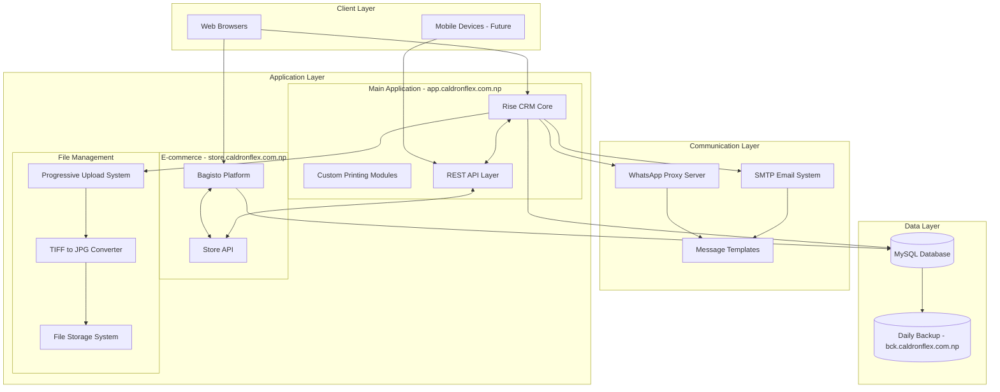
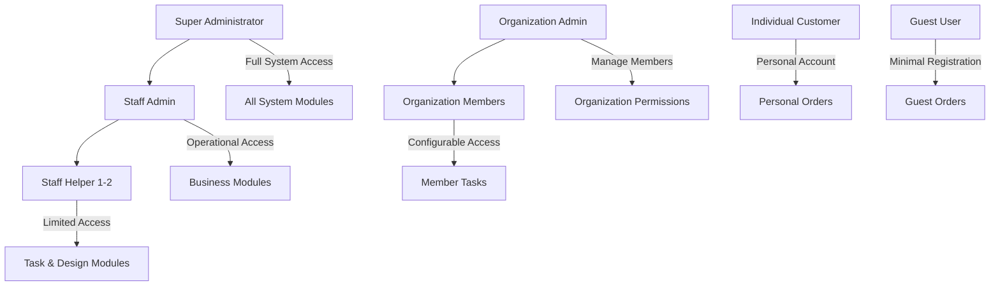
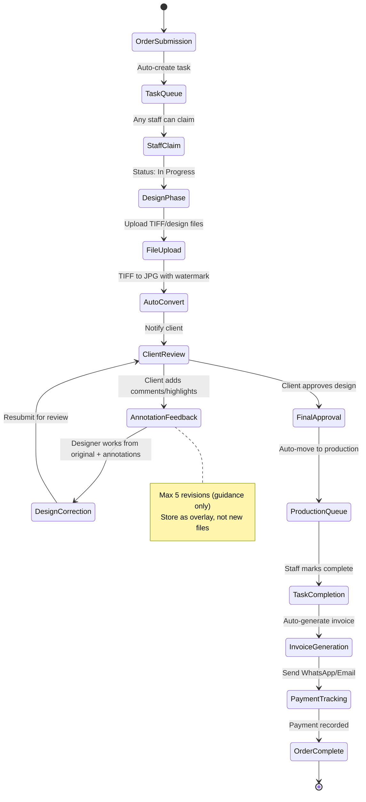
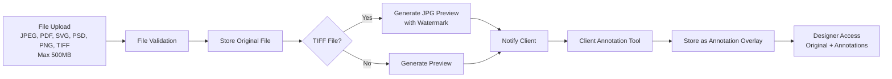
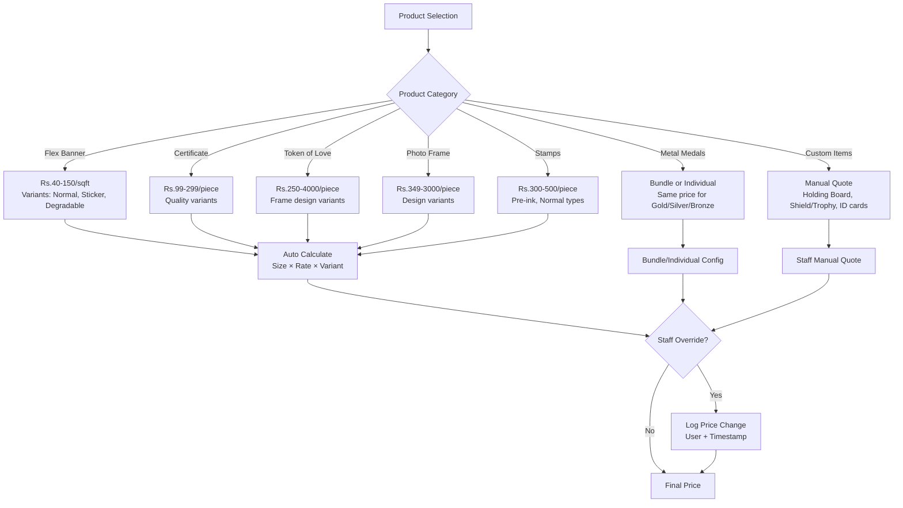
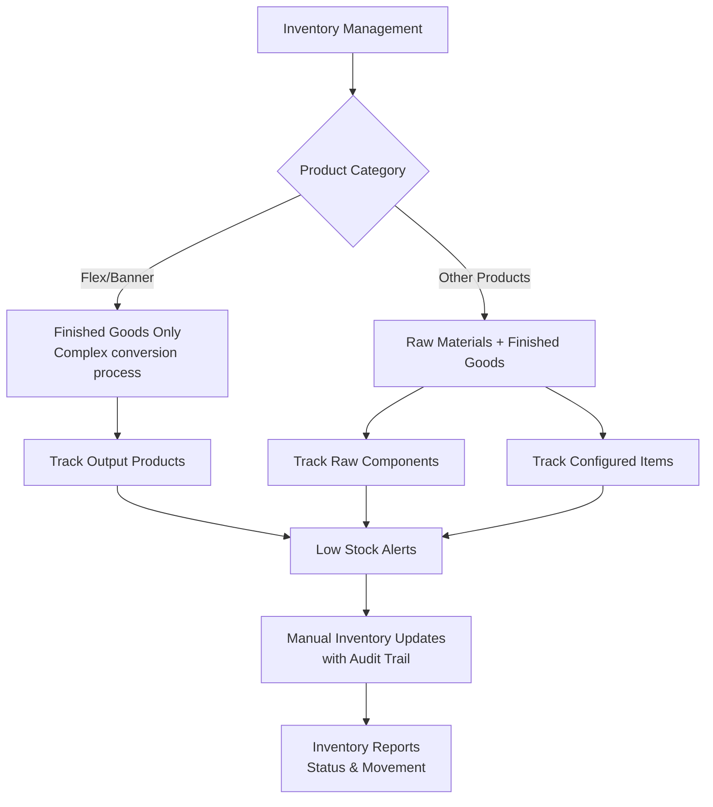
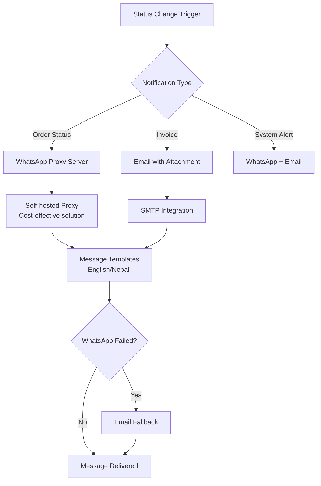
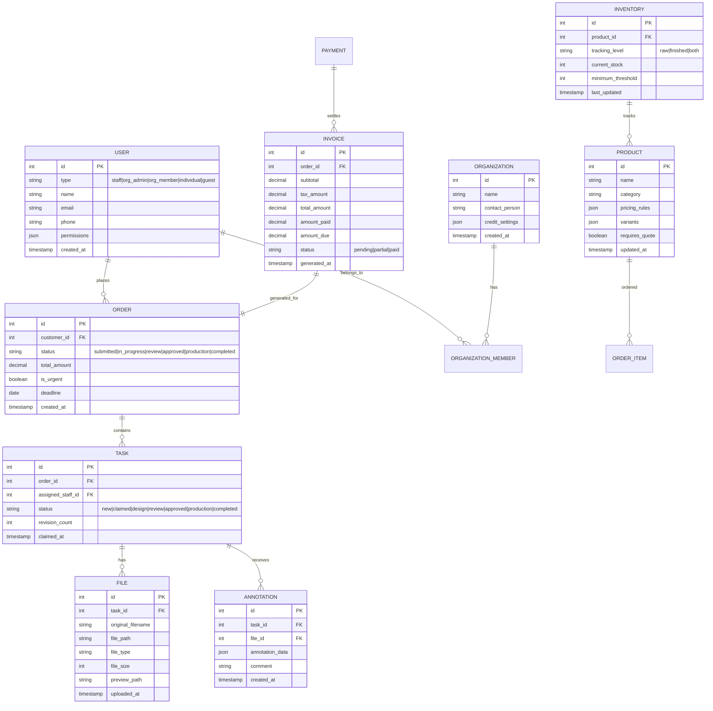

# Design Document

## Overview

The Caldron Flex All-in-One Printing Business Management System is designed as a comprehensive solution that integrates customer management, order processing, design workflow, inventory tracking, and e-commerce functionality. The system uses Rise CRM as the primary platform with Bagisto for e-commerce, deployed on cPanel hosting to serve 30 concurrent users processing 6 daily orders.

The design follows a "core and satellite" architecture approach to avoid the complexity of merging multiple platforms, with Rise CRM serving as the central "brain" and Bagisto providing e-commerce capabilities through API integration.

## Architecture

### System Architecture Overview

### Platform Integration Strategy

**Primary Platform: Rise CRM**
- Serves as the central database and logic handler
- Manages core CRM, project management, and business operations
- Handles user authentication and role-based permissions
- Processes order workflow and task management

**E-commerce Platform: Bagisto**
- Powers the public-facing storefront at store.caldronflex.com.np
- Handles product catalog for standardized items
- Manages customer browsing and ordering experience
- Provides AR/VR capabilities for 3D product previews

**API Integration Layer**
- Custom-built REST API for two-way synchronization
- Real-time data sync between Rise CRM and Bagisto
- Maintains single source of truth for customers, inventory, and orders
- Supports future mobile app and external integrations

### Deployment Architecture

**cPanel Hosting Constraints**
- No Docker support - requires traditional PHP/MySQL stack
- 3GB RAM allocation with 1.5TB storage capacity
- Simplified architecture optimized for cPanel environment
- Progressive file upload system for large design files

**Subdomain Structure**
- `app.caldronflex.com.np`: Main application (Rise CRM)
- `store.caldronflex.com.np`: E-commerce storefront (Bagisto)
- `bck.caldronflex.com.np`: Automated backup storage
- Additional subdomains for load distribution as needed

## Components and Interfaces

### User Management Component

**Role-Based Access Control**

**User Interface Components**
- Dynamic role creation interface for administrators
- Granular permission configuration for staff and organization members
- Minimal registration flow for guest users (name + phone only)
- Unified customer profile management across platforms

### Order Processing Workflow Component

**Task Queue Management System**

**Priority Management**
- Deadline-based automatic prioritization
- Visual "urgent" flag for rush orders
- Queue-based task claiming system (no manual assignment)
- Real-time status updates and notifications

### File Management and Design Proofing Component

**File Processing Pipeline**

**Annotation System Design**
- Web-based annotation tool with pin placement
- Simple commenting system for client feedback
- Overlay storage system (no full file versioning)
- Watermarked previews for intellectual property protection

### Product Information Management Component

**Dynamic Pricing Engine**

**Product Configuration Features**
- Annual price update capability
- Configurable product variants and attributes
- Staff price override with audit logging
- Future seasonal pricing with discount codes

### Inventory Management Component

**Mixed-Level Tracking System**

**Inventory Features**
- No barcode system initially (manual tracking)
- Automated low stock warnings
- Real-time inventory updates
- No integration with pricing calculations

### Communication System Component

**Multi-Channel Notification System**

**Communication Features**
- Bilingual support (English/Nepali)
- Configurable message templates
- Automatic fallback mechanisms
- Customer preference management

## Data Models

### Core Entity Relationships

### File Management Data Structure

**File Storage Strategy**
- Original files stored securely with access controls
- Automatic preview generation for supported formats
- Annotation data stored as JSON overlay
- Version control through annotation history

**File Processing Workflow**
- Progressive upload for large files (up to 500MB)
- Automatic TIFF to JPG conversion with watermarking
- Secure file access based on user permissions
- Integration with future Adobe Photoshop API

## Error Handling

### System Error Management

**File Processing Errors**
- Upload failures: Retry mechanism with user notification
- Conversion errors: Fallback to manual processing
- Storage issues: Alternative storage location with alerts

**Integration Errors**
- WhatsApp proxy failures: Automatic email fallback
- Bagisto sync errors: Queue-based retry system
- Database connection issues: Connection pooling and retry logic

**User Experience Errors**
- Form validation with clear error messages
- File size/format restrictions with helpful guidance
- Permission denied scenarios with appropriate redirects

### Data Integrity Protection

**Transaction Management**
- Database transactions for critical operations
- Rollback mechanisms for failed processes
- Data validation at multiple layers

**Backup and Recovery**
- Automated daily backups to separate subdomain
- Point-in-time recovery capabilities
- Regular backup integrity verification

## Testing Strategy

### Testing Approach

**Unit Testing**
- Core business logic components
- File processing and conversion functions
- Pricing calculation algorithms
- User permission validation

**Integration Testing**
- Rise CRM and Bagisto API synchronization
- WhatsApp and email notification systems
- File upload and processing pipeline
- Payment and invoice generation workflow

**User Acceptance Testing**
- Staff workflow testing with actual printing scenarios
- Customer order placement and review process
- Multi-language interface testing
- Mobile responsiveness validation

**Performance Testing**
- 30 concurrent user load testing
- Large file upload performance
- Database query optimization
- cPanel hosting constraint validation

### Quality Assurance

**Security Testing**
- Role-based access control validation
- File access permission verification
- Data encryption testing
- SQL injection and XSS prevention

**Usability Testing**
- Staff task management workflow
- Customer design review and annotation process
- Multi-language interface usability
- Mobile device compatibility

**Reliability Testing**
- System uptime and availability
- Error recovery and fallback mechanisms
- Data backup and restoration procedures
- Communication system reliability

## Implementation Considerations

### cPanel Hosting Optimization

**Technical Constraints**
- No Docker support requires traditional LAMP stack
- Memory optimization for 3GB RAM limitation
- Efficient file storage management for 1.5TB capacity
- Database query optimization for performance

**Deployment Strategy**
- Staged deployment with rollback capabilities
- Separate file storage account for large design files
- Load distribution across multiple subdomains
- Future migration path to VPS hosting

### Scalability Planning

**Current Capacity**
- 30 concurrent users with 6 daily orders
- Support for 3x volume growth without additional staff
- Efficient task queue management
- Optimized database design for growth

**Future Expansion**
- Mobile app development within 3-4 months
- AR/VR integration within 1 year
- Adobe Photoshop API integration
- Advanced analytics and reporting capabilities

This design provides a comprehensive foundation for the Caldron Flex printing business management system, addressing all requirements while maintaining flexibility for future enhancements and scalability.